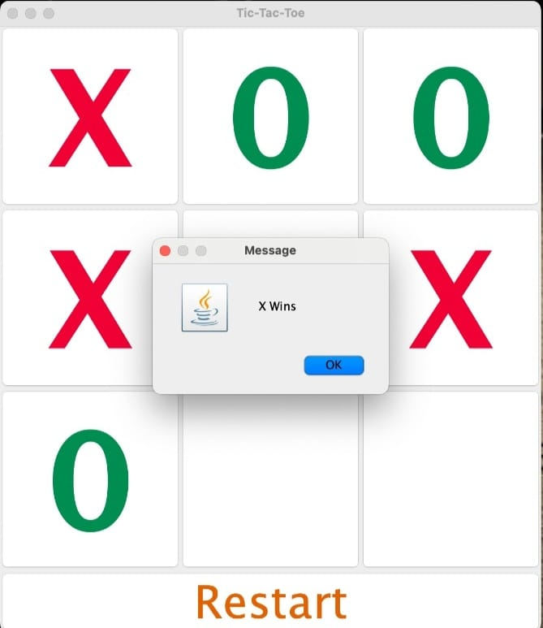
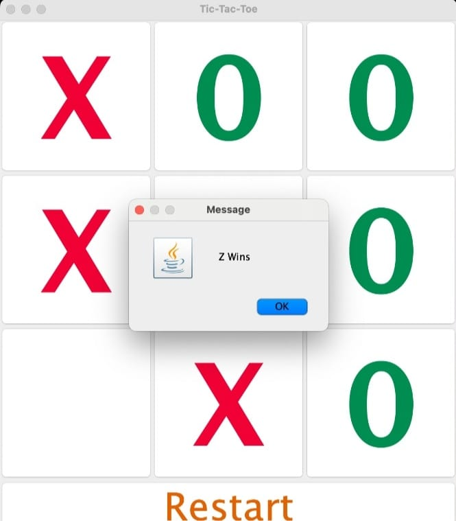
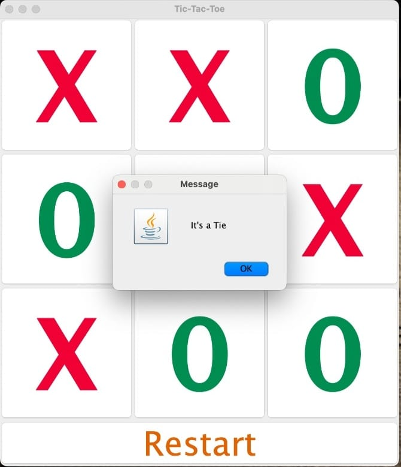
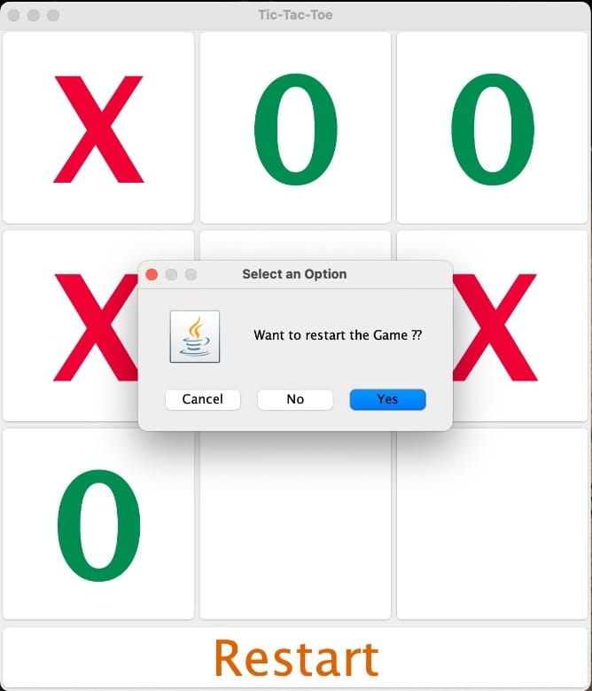

# TicTacToe

<b>Description:</b>
Developed a graphical user interface (GUI) based Tic-Tac-Toe game using Java and Swing library. The project aimed to create an interactive and visually appealing gaming experience.

<b>Key Contributions:</b>
Designed and implemented the GUI layout using Swing components, providing an intuitive and user-friendly interface.
Implemented event handling to capture user interactions, allowing seamless gameplay.
Utilized layout managers for effective organization of components, ensuring a responsive and aesthetically pleasing design.
Incorporated graphics and font customization to enhance the visual appeal of the game.
Technologies and Skills Used:

-> Programming Language: Java
-> GUI Development: Java Swing library
-> Event Handling: ActionListener interfaces
-> Layout Management: BorderLayout and GridLayout
-> Graphics and Fonts: Java Font class, Color customization
-> Enums: Used to represent different game states
-> Array Usage: Managed the game state using a 2D array
-> Dialog Boxes: Utilized JOptionPane for user interaction

